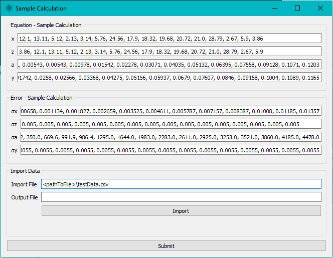

# **Error Propagation tool**

Designed to find the error propagation equation and sample calculation. It then outputs result in latex form to copy paste into report. 

## **Prerequisites**

This small python3 program makes heavy use of the **PyQt5** and **Sympy** framework.
You can install them by running.

 ```bash
 pip install pyqt5
 pip install sympy
 pip install pandas
 ```

## **Usage**

After ensuring that you`ve installed all the prerequisites mentioned above. Launch the application with,

```bash
python main.py
```

 The window presented in figure 1 will pop up. Note that preloaded equation is for test purposes you can edit the source if you wish to get rid of it, **mainWindow.py, line 71.**


* **Equation** : Expression on which you wish to error propagate.
* **Variables**: Specify differentiable variables, constants should not be included.

Hitting the submit button launches the sample calculation window presented in Figure 2. Sample calculation variables includes both constants and variables. As seen by the example used. The ***symbol a*** was not specified as a varible but still shows up in the sample calculation window.



**Note:** Providing a list of values as shown in figure above will produce a table showing the equatiuons evaluation and the corresponding error.

Hitting submit on the sample calculation window populates the latex Output box in the mainwindow as seen in Figure 3.
 
 
 
View the output on any latex interpreter.

## To be Implemented

* Significant figures for data presentation
* Context Menus