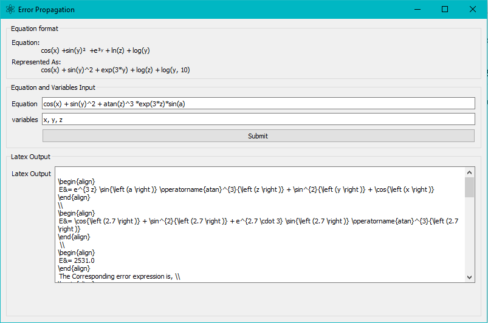

# **Error Propagation tool**

Designed to find the error propagation equation and perform sample calculations. It then outputs result in latex form to copy paste into report.

## **Prerequisites**

This small python3 program makes heavy use of the **PyQt5** and **Sympy** framework. **Pandas** is required only if you mean to output a table.
You can install them by running.

 ```bash
 pip install pyqt5
 pip install sympy
 pip install pandas
 ```

## **Usage**

After ensuring that you`ve installed all the prerequisites mentioned above. Launch the application with,

```bash
python main.py
```

 The window presented in figure 1 will pop up. Note that preloaded equation is for test purposes you can edit the source if you wish to get rid of it, **mainWindow.py, line 72.**


* **Equation** : Expression on which you wish to error propagate.
* **Variables**: Specify differentiable variables, constants should not be included.

Hitting the submit button launches the sample calculation window presented in Figure 2. Sample calculation variables includes both constants and variables. As seen by the example used. The ***symbol a*** was not specified as a varible but still shows up in the sample calculation window.


**Note:** Providing a list of values as shown in figure above will produce a table showing the equation`s evaluation and the corresponding error.
## **Importing Data**

CSV data can be imported by providing a relative or absolute path in the import file window. Hitting submit launches a Table View that enables you to load data into variables.
Column data can be loaded into specific variables by renaming the first column to the respective variable you wish to load the data into.

 

**Note:** Data selection can be verified by the header name of the column changing to the variable the data has been imported to. Hit done to finish loading data.

Hitting submit on the sample calculation window populates the latex Output box in the mainwindow as seen in Figure 3.
 
 
 
 ## **Importing Data**
 
 * Output CSV data.
 
View the output on any latex interpreter.
